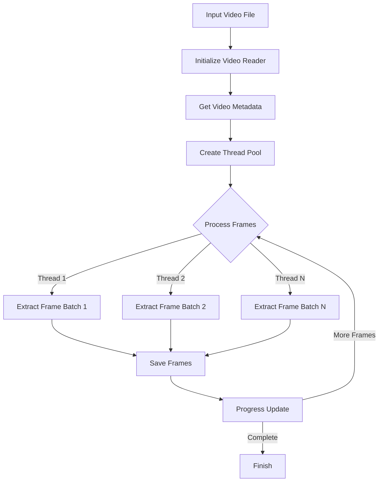

# Video Frame Extractor 🎥

A high-performance Python tool for extracting frames from video files with multi-threading support and rich visualization features.

## 📑 Table of Contents

- [Features](#-features)
- [Process Flow](#-process-flow)
- [Prerequisites](#-prerequisites)
- [Virtual Environment Setup](#-virtual-environment-setup)
- [Installation](#-installation)
- [Usage](#-usage)
  - [Command Line Interface](#command-line-interface)
  - [Arguments](#arguments)
  - [Jupyter Notebook](#jupyter-notebook)
- [Output](#-output)
- [Contributing](#-contributing)
- [License](#-license)
- [Acknowledgments](#-acknowledgments)

## 🚀 Features

- Multi-threaded frame extraction for optimal performance
- Real-time progress tracking with Rich console
- Detailed video metadata display
- Cross-platform compatibility
- Configurable thread count
- Robust error handling
- Jupyter Notebook integration support

## 🔄 Process Flow



## 📋 Prerequisites

- Python 3.6 or higher
- Required packages for CLI:
  ```bash
  pip install opencv-python rich
  ```
- Additional packages for Jupyter Notebook:
  ```bash
  pip install numpy matplotlib jupyter ipython
  ```

## 🔮 Virtual Environment Setup

1. Create a virtual environment:
   ```bash
   python -m venv venv
   ```

2. Activate the virtual environment:
   
   Windows:
   ```bash
   .\venv\Scripts\activate
   ```
   
   Linux/Mac:
   ```bash
   source venv/bin/activate
   ```

3. Verify activation (you should see (venv) in your terminal):
   ```bash
   python --version
   ```

## 💻 Installation

1. Clone or download this repository
    ```bash
    git clone https://github.com/ToolsHive/Forensi-Frame.git
    ``` 

2. Install all dependencies:
   ```bash
   pip install -r requirements.txt
   ```

## 🔧 Usage

### Command Line Interface

```bash
python script.py <video_path> <output_directory> [--threads N]

```
### Example:

```bash
python script.py sample.mp4 frames --threads 8
```

### Arguments

- `video_path`: Path to the input video file
- `output_directory`: Directory where extracted frames will be saved
- `--threads`: Number of threads to use (default: 4)

### Jupyter Notebook

You can also use the provided Jupyter notebook `Video_Frame_Extractor.ipynb` for an interactive experience with additional visualization features.

## 📊 Output

- Frames are saved as sequential JPEG images
- Naming format: `frame_XXXX.jpg`
- Video metadata is displayed in a formatted table
- Progress bar shows extraction status


## 👥 Contributing

1. Fork the repository
2. Create feature branch (`git checkout -b feature/name`)
3. Commit changes (`git commit -am 'Add feature'`)
4. Push branch (`git push origin feature/name`)
5. Create Pull Request

## 📜 License

This project is licensed under the MIT License - see the LICENSE file for details.

## 🙏 Acknowledgments

- OpenCV for video processing capabilities
- Rich library for terminal visualization
- Python's concurrent.futures for multi-threading support
